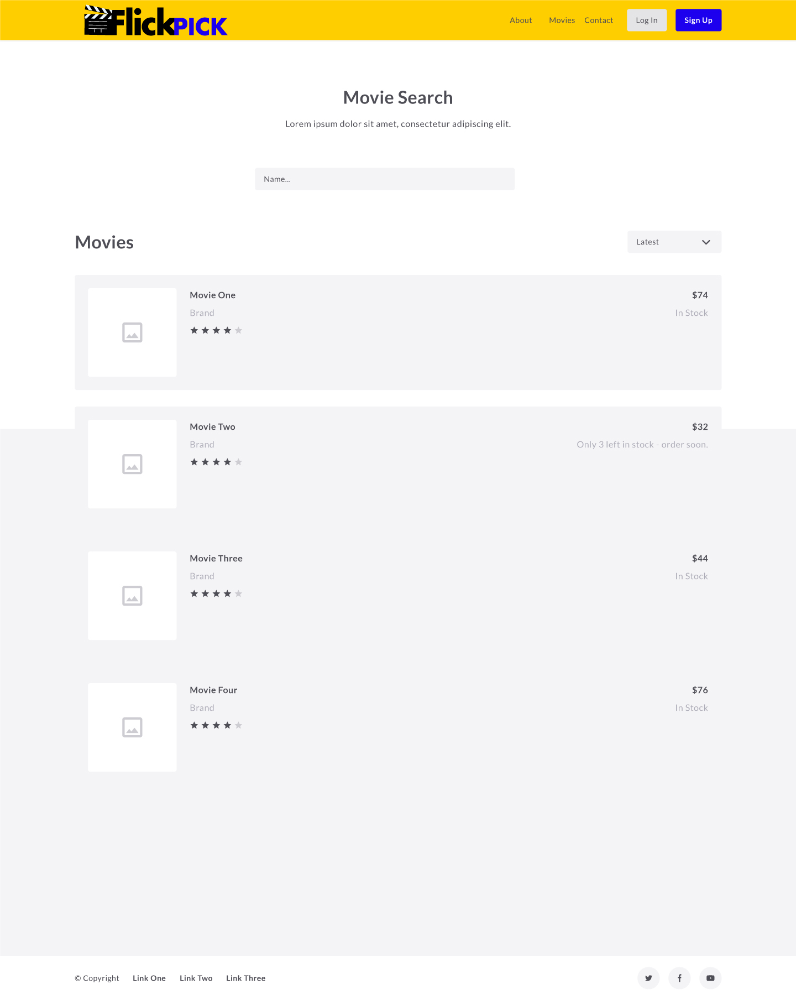

# Planning


## Collaborators

Shane Vann-Shirley, Paula Bannerman, Melika Rasti

## Goal

Our goal is to create a movie app that allows a user to log in, search for movies by various identifiers, and then store movies in a to-do list

## Reached Goal
It searches through 2000 movies and you are able to select movies to add to a favorites list.
 * Authentication
 * Personalize favorites lists
 * CRUD via Favorites (add, update, or delete movies from their movie to-do list.)
 * View movies randomly through the movie page
 * View all movies of a certain genre
 * Genre list splits the movie into pages


## Models Used

```
User {
  name: String,
  password: String,
  listOfMovies: []
}
```

```
Movie {
  id: Number,
  title: String,
  overview: String,
  original_language: String,
  posterImage: String,
  videoExists: Boolean,
  videoKey: String,
  vote_average: Number,
  release_date: Date,
  genre_ids: Array,
  genres: []
}
```

```
Genre {
  id: Number,
  name: String
}
```

## Bonus Objectives

Adding authentication for users, embedding videos

## Distribution of Work

Melika and Shane - back end
Shane, Melika and Paula - front end

## Ideally Expected Timeframe goals
Planning
Tuesday - MVP
Wednesday - Complete styling
Thursday/Friday - Bonus work and presentation preparation

## Actual Timeframe goals
Monday - Planning
Thursday - MVP
Friday - Complete styling
Tuesday-Friday - Bonus work
Friday presentation preparation
##Video
<figure class="video_container">
  <iframe src="https://player.vimeo.com/video/344644642" frameborder="0" allowfullscreen="true" width="500px"> </iframe>
</figure>
## Wireframe for App




